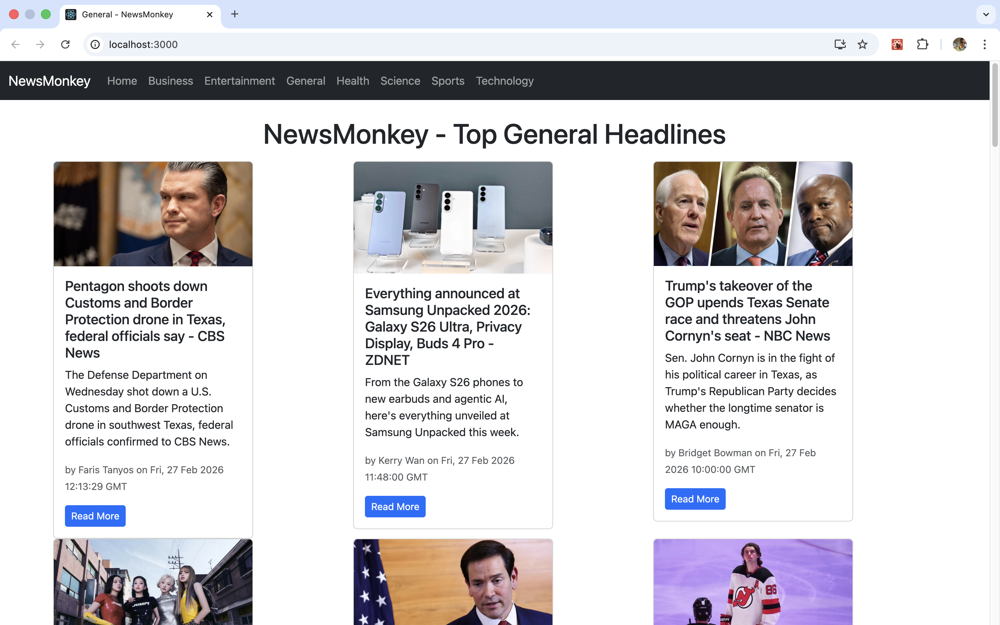

# 📰 NewsMonkey – React News Web App

NewsMonkey is a responsive news web application built using **React.js** that fetches real-time news articles from a public News API.  
It provides categorized news with a clean UI and smooth user experience.

---

## 🚀 Live Demo

👉 Add your deployed link here (Netlify / Vercel / GitHub Pages)

---

## 📌 Features

- 🗂 Category-based news (Business, Sports, Technology, Entertainment, Health, Science)
- 🌍 Top headlines by country
- 🔄 Real-time news fetching using API
- ⚡ Loading spinner for better UX
- 📱 Fully responsive design
- 🔎 Clean and minimal user interface

---

## 🛠 Tech Stack

- **Frontend:** React.js
- **Styling:** CSS
- **Language:** JavaScript (ES6+)
- **API:** News API
- **Routing:** React Router

---

## 📂 Project Structure

```
NewsMonkey/
│
├── src/
│   ├── components/
│   ├── App.js
│   ├── index.js
│   └── ...
│
├── public/
├── package.json
└── README.md
```

---

## ⚙️ Installation & Setup

### 1️⃣ Clone the repository

```bash
git clone https://github.com/ommbhor/NewsMonkey.git
```

### 2️⃣ Navigate to project folder

```bash
cd NewsMonkey
```

### 3️⃣ Install dependencies

```bash
npm install
```

### 4️⃣ Add your News API Key

Create a `.env` file in the root directory and add:

```
REACT_APP_NEWS_API=your_api_key_here
```

You can get your API key from: https://newsapi.org/

### 5️⃣ Start the development server

```bash
npm start
```

The app will run on:

```
http://localhost:3000
```

---


## 📸 Screenshots

### 🏠 Home Page


### 📰 News Category Page


## 🌟 Future Improvements

- Dark mode
- Search functionality
- Pagination / Infinite scroll
- Bookmark feature
- Deployment with custom domain
- Performance optimization

---

## 🤝 Contributing

Pull requests are welcome. For major changes, please open an issue first to discuss what you would like to change.

---

## 📄 License

This project is open-source and available under the MIT License.

---

## 👨‍💻 Author

**Om Bhor**

- GitHub: https://github.com/ommbhor
- LinkedIn: Add your LinkedIn profile link here


# Getting Started with Create React App

This project was bootstrapped with [Create React App](https://github.com/facebook/create-react-app).

## Available Scripts

In the project directory, you can run:

### `npm start`

Runs the app in the development mode.\
Open [http://localhost:3000](http://localhost:3000) to view it in your browser.

The page will reload when you make changes.\
You may also see any lint errors in the console.

### `npm test`

Launches the test runner in the interactive watch mode.\
See the section about [running tests](https://facebook.github.io/create-react-app/docs/running-tests) for more information.

### `npm run build`

Builds the app for production to the `build` folder.\
It correctly bundles React in production mode and optimizes the build for the best performance.

The build is minified and the filenames include the hashes.\
Your app is ready to be deployed!

See the section about [deployment](https://facebook.github.io/create-react-app/docs/deployment) for more information.

### `npm run eject`

**Note: this is a one-way operation. Once you `eject`, you can't go back!**

If you aren't satisfied with the build tool and configuration choices, you can `eject` at any time. This command will remove the single build dependency from your project.

Instead, it will copy all the configuration files and the transitive dependencies (webpack, Babel, ESLint, etc) right into your project so you have full control over them. All of the commands except `eject` will still work, but they will point to the copied scripts so you can tweak them. At this point you're on your own.

You don't have to ever use `eject`. The curated feature set is suitable for small and middle deployments, and you shouldn't feel obligated to use this feature. However we understand that this tool wouldn't be useful if you couldn't customize it when you are ready for it.

## Learn More

You can learn more in the [Create React App documentation](https://facebook.github.io/create-react-app/docs/getting-started).

To learn React, check out the [React documentation](https://reactjs.org/).

### Code Splitting

This section has moved here: [https://facebook.github.io/create-react-app/docs/code-splitting](https://facebook.github.io/create-react-app/docs/code-splitting)

### Analyzing the Bundle Size

This section has moved here: [https://facebook.github.io/create-react-app/docs/analyzing-the-bundle-size](https://facebook.github.io/create-react-app/docs/analyzing-the-bundle-size)

### Making a Progressive Web App

This section has moved here: [https://facebook.github.io/create-react-app/docs/making-a-progressive-web-app](https://facebook.github.io/create-react-app/docs/making-a-progressive-web-app)

### Advanced Configuration

This section has moved here: [https://facebook.github.io/create-react-app/docs/advanced-configuration](https://facebook.github.io/create-react-app/docs/advanced-configuration)

### Deployment

This section has moved here: [https://facebook.github.io/create-react-app/docs/deployment](https://facebook.github.io/create-react-app/docs/deployment)

### `npm run build` fails to minify

This section has moved here: [https://facebook.github.io/create-react-app/docs/troubleshooting#npm-run-build-fails-to-minify](https://facebook.github.io/create-react-app/docs/troubleshooting#npm-run-build-fails-to-minify)
